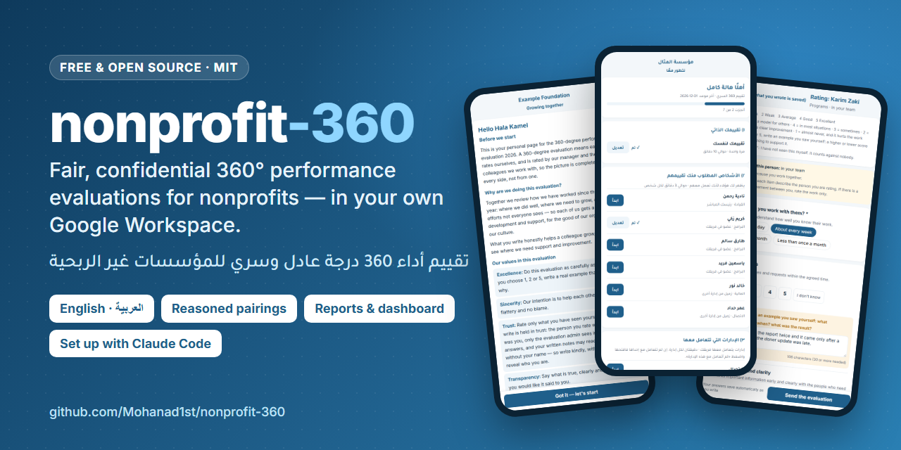
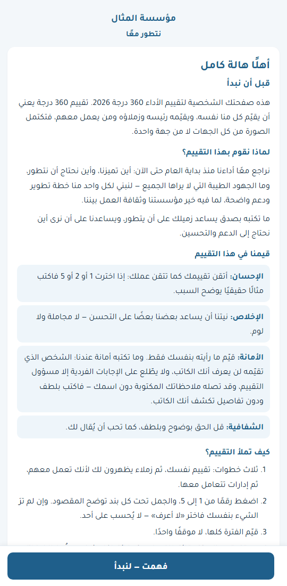
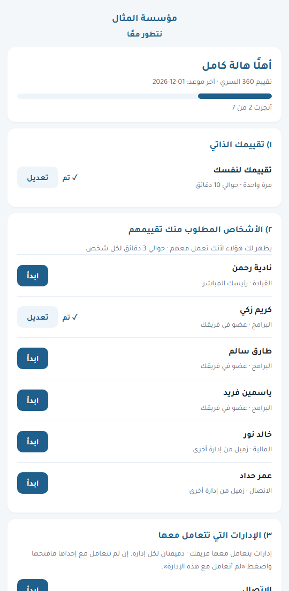
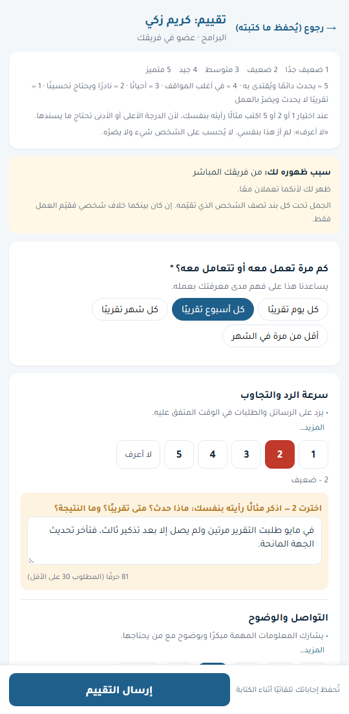

# nonprofit-360

> صيغ النص العربي بمساعدة الذكاء الاصطناعي. اطلبوا من متحدث أصلي أن يقرأه قبل دورتكم الأولى، والتحسينات مرحّب بها.

**تقييم أداء 360 درجة مجاني ومفتوح المصدر للمؤسسات غير الربحية — بالعربية والإنجليزية، ويعمل داخل حساب Google الخاص بكم.**

[English](README.md) · [دليل الإعداد](docs/ar/setup-guide.md) · [إدارة التقييم](docs/ar/admin-guide.md) · [الأخلاقيات والخصوصية](docs/ar/ethics-and-privacy.md) · [الأسئلة الشائعة](docs/ar/faq.md)

| نظرة سريعة | |
|---|---|
| **لمن** | المؤسسات غير الربحية التي يتراوح عدد العاملين فيها بين 5 و100 تقريبًا، وتستخدم **Google Workspace** (بريد عمل على نطاقكم الخاص تديره Google) |
| **التكلفة** | الأداة مجانية. أما مساعد Claude Code الاختياري فيحتاج إلى اشتراك مدفوع في Claude (خطة Pro: 20 دولارًا شهريًا، أو 17 عند الدفع السنوي)؛ والإعداد يدويًا لا يكلّف شيئًا. |
| **الوقت** | نحو ساعتين أمام الحاسوب، إضافة إلى بضعة أيام لسؤال الرؤساء عمّن يعمل مع من. يحتاج كل شخص إلى نحو 10 دقائق، إضافة إلى 3 دقائق لكل زميل يقيّمه. |
| **ما تحصلون عليه** | ملف نتائج خاص، وتقرير لكل شخص تناقشونه معه، وتقرير للمؤسسة مع رسوم بيانية |
| **الخطوة الأولى** | [تأكدوا أنكم تملكون Google Workspace](docs/ar/faq.md#هل-لدينا-google-workspace)، ثم اتبعوا [دليل الإعداد](docs/ar/setup-guide.md) |

في تقييم 360 يقيّم كل شخص نفسه، ويقيّمه رئيسه المباشر والزملاء الذين يعمل معهم، فتكتمل الصورة من كل الجهات.
يجعل nonprofit-360 ذلك عادلًا وسريًا وبسيطًا للمؤسسات الصغيرة التي ليس لديها موظفو تقنية ولا ميزانية لبرامج الموارد البشرية.

| صفحة الترحيب | قائمة كل شخص | تقييم شخص |
|---|---|---|
|  |  |  |

## ما تحصلون عليه
- **صفحة شخصية لكل شخص.** تعرف من هو من حساب عمله في Google. يقيّم نفسه، والزملاء الذين يعمل معهم (مع إظهار السبب)،
  والإدارات التي يتعامل معها. تعمل على الهاتف، وتحفظ أثناء الكتابة، ويستطيع أن يتوقف ويتابع لاحقًا.
- **عادلة بالتصميم.**
  - لكل تكليف سبب مكتوب؛ ولا يُكلَّف أحد عشوائيًا.
  - الدرجات 1 و2 و5 تحتاج إلى مثال حقيقي.
  - «لا أعرف» لا تُحسب ضد أحد أبدًا.
  - الرئيس الذي يعطي درجة منخفضة يُسأل: ماذا فعلتَ للمساعدة؟
- **سرية بالتصميم.**
  - مسؤول التقييم وحده يرى الإجابات الفردية (ومن يمنحه صلاحية التعديل على الملف).
  - لا يُعرض شيء عن مجموعة أقل من 3 أشخاص.
  - تقارير الموظفين بلا أسماء.
  - لا يُشارك شيء حتى يقرّر مسؤول التقييم.
- **إشارات لا أحكام.** تنبيهات تلقائية لـ:
  - تقييمات الانتقام أو المجاملة؛
  - رئيس يقيّم فريقه أقل بكثير من الجميع؛
  - نقد بلا متابعة؛
  - توقعات لم تُحدَّد مسبقًا؛
  - نقاط عمياء؛
  - نجوم هادئين لا يراهم أحد.
- **تقارير ولوحة متابعة.**
  - لكل شخص: نسخة المسؤول الكاملة ونسخة الموظف لتسليمها في محادثة.
  - تقرير للمؤسسة.
  - رسوم بيانية في كل منها.
- **نماذج ورقية** للموظفين بلا بريد إلكتروني.
- **بالعربية والإنجليزية، بالكامل من اليمين إلى اليسار.** مع قيمكم وشعاركم وألوانكم في كل مكان.
- **مجاني.** لا خادم ولا اشتراك: يعمل داخل Google Workspace الخاص بكم، وهو مجاني للمؤسسات غير الربحية المسجّلة.
  والإجابات والنتائج لا تغادر حساب Google الخاص بكم أبدًا.

## ابدؤوا

### بإرشاد Claude Code (يحتاج إلى اشتراك مدفوع في Claude)
1. ثبّتوا [تطبيق Claude لسطح المكتب](https://claude.com/download) وسجّلوا الدخول. ثبّتوا أيضًا [Node.js](https://nodejs.org)
   (الزر المكتوب عليه **LTS**)؛ يستخدمه Claude لفحص نسختكم وبنائها.
2. نزّلوا هذا المشروع: في هذه الصفحة اضغطوا الزر الأخضر **Code** ثم **Download ZIP** (تنزيل ملف مضغوط). في مجلد التنزيلات
   اضغطوا على الملف بزر الفأرة الأيمن ثم **Extract All** (استخراج الكل)، وانقلوا المجلد إلى المستندات (استخدموا المجلد الذي فيه
   `README.md` مباشرةً).
3. في تطبيق Claude افتحوا **Code**، واختاروا ذلك المجلد، واكتبوا **`/setup-360`** في مربع الرسالة، ثم اضغطوا Enter.
   يستأذنكم Claude قبل كل خطوة يشغّلها على حاسوبكم: اقرؤوا سببه في سطر واحد، ثم اضغطوا **السماح** (`Allow`).
4. أجيبوا عن أسئلته بكلمات بسيطة: فريقكم، ومن يعمل مع من، وقيمكم، وآخر موعد. يجهّز Claude كل شيء، ويضعه في حساب
   Google الخاص بكم، ويرشدكم خلال النقرات القليلة التي لا يستطيع أحد غيركم إجراءها.

**ملاحظة عن الخصوصية:** ما تكتبونه أو تلصقونه في Claude (الأسماء، وبريد العمل، ومن يرأس من) يُرسل إلى Anthropic حتى يستطيع
Claude الرد عليكم. لا يحتاج Claude إلى التقييمات ولا إلى التعليقات؛ فلا تلصقوها. تبقى الملفات المجهّزة في مجلد خاص
اسمه `org` على حاسوبكم وفي حساب Google الخاص بكم؛ ولا تُرفع أبدًا إلى GitHub. وإذا كان إطلاع خدمة ذكاء اصطناعي على قائمة
الفريق غير مقبول لديكم، فاستخدموا الطريقة اليدوية أدناه.

### يدويًا (مجانًا ودون Claude Code)
1. أنشئوا ملف Google Sheets جديدًا، ثم اضغطوا **الإضافات** ثم **Apps Script**، والصقوا الملف [`dist/Code.gs`](dist/Code.gs) كاملًا، ثم احفظوا.
   وفي واجهة Google الإنجليزية: `Extensions → Apps Script`.
2. أعيدوا تحميل الملف، ثم اختاروا القائمة «360» ← «ابدأ الإعداد» ← املؤوا اللوحة الجانبية ← اضغطوا «احفظ وأنشئ التبويبات».
3. أعيدوا تحميل الملف مرة أخرى: صارت القائمة تُسمّى «تقييم 360»، ويعرض تبويب «ابدأ هنا» كل خطوة.
4. املؤوا تبويبي «الفريق» و«روابط العمل» ← «2) افحص الفريق والروابط» ← «3) توليد قائمة من يقيّم من».
5. «4) نشر الصفحة الشخصية» (تظهر نافذة فيها الخطوات الست) ← «5) أرسل لي معاينة».
6. عندما تكونون راضين: «6) إرسال الدعوات للفريق».

الخطوات الكاملة مع الصور: [دليل الإعداد](docs/ar/setup-guide.md).

**ما تحتاجونه:** Google Workspace (مجاني للمؤسسات غير الربحية عبر [Google for Nonprofits](https://www.google.com/nonprofits/)).
حسابات Gmail الشخصية غير مدعومة في هذا الإصدار.

## للمطوّرين
- الكود المصدري في [`src/`](src/) (Google Apps Script). الأمر `npm run build` يضمّه في [`dist/Code.gs`](dist/Code.gs).
- الاختبارات: `npm test`. تفحص التحليل، واللغتين، والمسار كله على خدمات Google وهمية، وقواعد منع التسرب،
  والتوقف والمتابعة، وتشغيلًا حقيقيًا في المتصفح لكل شخص من الفريق التجريبي بكلتا اللغتين.
- راجعوا [وثيقة المنتج](docs/PRD.md) و[البنية](docs/ARCHITECTURE.md) و[المساهمة](CONTRIBUTING.md) و[الأمان](SECURITY.md).

## تحتاجون مساعدة؟
اكتبوا `/fix-360` في Claude Code، أو اقرؤوا [حل المشكلات](docs/ar/troubleshooting.md)، أو افتحوا بلاغًا (issue) على GitHub
(حساب مجاني؛ ولا تضعوا فيه أبدًا أسماء حقيقية أو إجابات).

## الرخصة
[MIT](LICENSE). حرّ في الاستخدام والتعديل والمشاركة، بما في ذلك للمؤسسات الأخرى.

