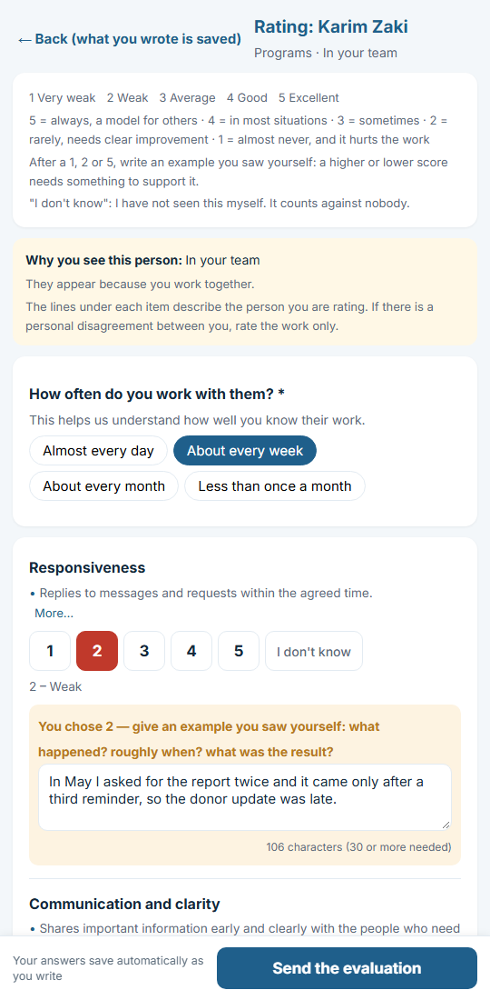

# nonprofit-360

    

**A free, open-source 360-degree performance evaluation for nonprofits — in English and Arabic, running in your own Google account.**

[العربية](README.ar.md) · [Setup guide](docs/en/setup-guide.md) · [Admin guide](docs/en/admin-guide.md) · [Ethics and privacy](docs/en/ethics-and-privacy.md) · [FAQ](docs/en/faq.md) · [Product document](docs/PRD.md)

| | |
|---|---|
| **For** | Nonprofits of about 5–100 staff that use **Google Workspace** (work emails on your own domain, managed by Google) |
| **Cost** | The tool is free. The optional Claude Code helper needs a paid Claude plan; setting up by hand costs nothing. |
| **Time** | About 2 hours to set up. Each person needs about 10 minutes, plus 3 minutes for each colleague they rate. |
| **You get** | A private results sheet, a report per person to discuss with them, and an organisation report with charts |
| **First step** | [Check you have Google Workspace](docs/en/faq.md#do-we-have-google-workspace), then follow the [Setup guide](docs/en/setup-guide.md) |

In a 360 evaluation, each person rates themselves and is rated by their manager and the colleagues they work with, so the
picture is complete from every side. nonprofit-360 makes that fair, confidential and simple for small organisations with
no IT staff and no budget for HR software.

| The welcome page | Each person's list | Rating someone |
|---|---|---|
|  |  |  |

## What you get
- **One personal page per person.** It knows who they are from their Google work account. They rate themselves, the
  colleagues they work with (with the reason shown), and the departments they deal with. It works on a phone, saves as
  they go, and they can stop and continue later.
- **Fair by design.**
  - Every pairing has a written reason; nobody is paired at random.
  - Scores of 1, 2 or 5 need a real example.
  - "I don't know" never counts against anyone.
  - A manager who gives a low score is asked what they did to help.
- **Confidential by design.**
  - Only the admin sees individual answers.
  - Nothing is shown about a group of fewer than 3 people.
  - Employee reports have no names.
  - Nothing is shared until the admin decides.
- **Signals, not verdicts.** Automatic flags for:
  - revenge or flattery ratings;
  - a manager who rates the team far below everyone else;
  - criticism without follow-up;
  - expectations never set;
  - blind spots;
  - quiet stars whose work goes unseen.
- **Reports and a dashboard.**
  - Per person: the admin's full copy and an employee copy to hand over in a conversation.
  - An organisation report.
  - Charts in all of them.
- **Paper forms** for staff without email.
- **English and Arabic, fully right-to-left.** Your values, logo and colours throughout.
- **Free to run.** No server and no subscription: it runs in your own Google Workspace, which is free for registered
  nonprofits. The answers and results never leave your Google account.

## Get started

### Easiest: let Claude Code do it (needs a paid Claude plan)
1. Install the [Claude desktop app](https://claude.com/download) and sign in. Also install [Node.js](https://nodejs.org)
   (the button marked "LTS"); Claude uses it to check and build your copy.
2. Download this project: on this page press the green **Code** button → **Download ZIP**. In your Downloads folder,
   right-click the file → **Extract All**, and move the folder to Documents.
3. In the Claude app open **Code**, choose that folder, type **`/setup-360`** in the message box and press Enter.
4. Answer its questions in plain words: your team, who works with whom, your values and your deadline. Claude prepares
   everything, puts it in your Google account, and guides you through the few clicks only you can do.

**Privacy note:** what you type or paste into Claude (names, work emails, who manages whom) is sent to Anthropic so
Claude can answer you. Claude never needs ratings or comments; do not paste them. The prepared files stay in a private
`org` folder on your computer and in your own Google account; they are never uploaded to GitHub. If sharing the team
list with an AI service is not acceptable for you, use the by-hand route below.

### By hand (free, no Claude Code)
1. Make a new Google Sheet → **Extensions → Apps Script** → paste the whole of [`dist/Code.gs`](dist/Code.gs) → Save.
2. Reload the sheet → menu **360** → **Start setup** → fill in the side panel → **Save and build my tabs**.
3. Reload the sheet again: the menu is now called **360 evaluation**, and the **Start here** tab lists every step.
4. Fill in the **Team** and **Work links** tabs → **2) Check my team and links** → **3) Make the pairings (who rates whom)**.
5. **4) Publish the personal page** (a window shows the six steps) → **5) Send me a preview**.
6. When you are happy: **6) Send the invitations to the team**.

Full steps with pictures: [Setup guide](docs/en/setup-guide.md).

**You need:** Google Workspace (free for nonprofits through [Google for Nonprofits](https://www.google.com/nonprofits/)).
Personal Gmail accounts are not supported in this version.

## For developers
- The source is in [`src/`](src/) (Google Apps Script). `npm run build` joins it into [`dist/Code.gs`](dist/Code.gs).
- Tests: `npm test`. They check the analysis, both languages, the whole flow against fake Google services, the leak
  rules, stop-and-continue, and a real-browser run of every example person in both languages.
- See [Architecture](docs/ARCHITECTURE.md), [Contributing](CONTRIBUTING.md), [Security](SECURITY.md) and the [security and readiness audit](docs/SECURITY-AUDIT.md).

## Need help?
Type `/fix-360` in Claude Code, read [Troubleshooting](docs/en/troubleshooting.md), or open an issue on GitHub
(a free account; never include real names or answers).

## A note on the words
The English and Arabic text was drafted with AI help. Please have a native speaker read it before your first round;
improvements are very welcome as pull requests.

## Licence
[MIT](LICENSE). Free to use, change and share, including for other organisations.
