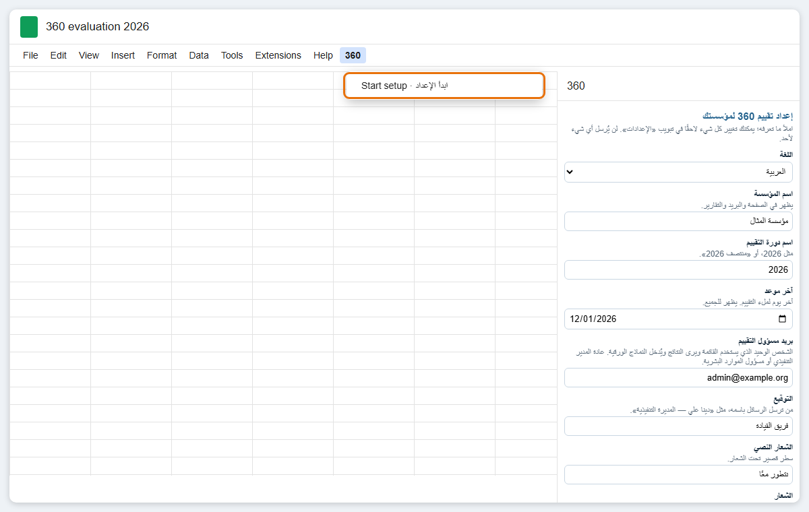
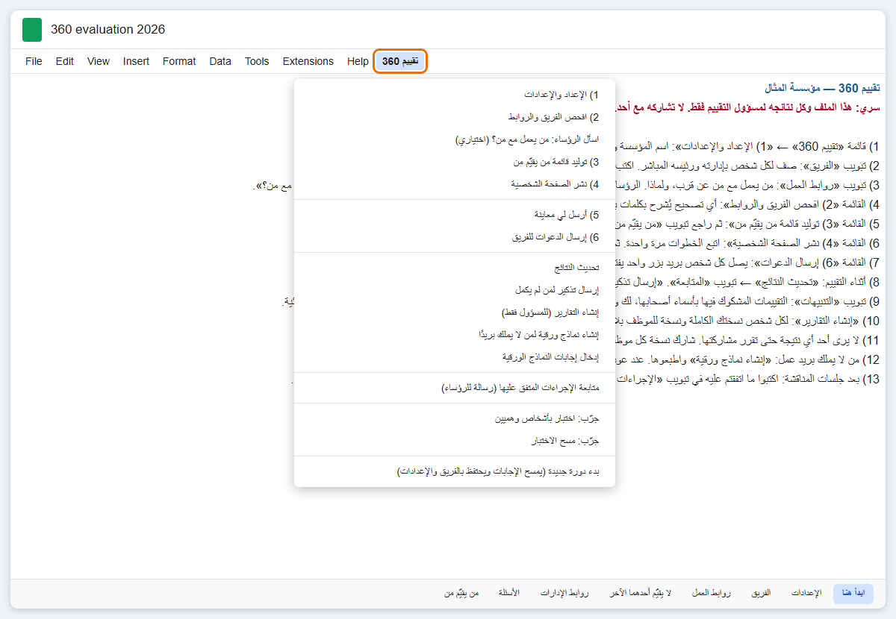
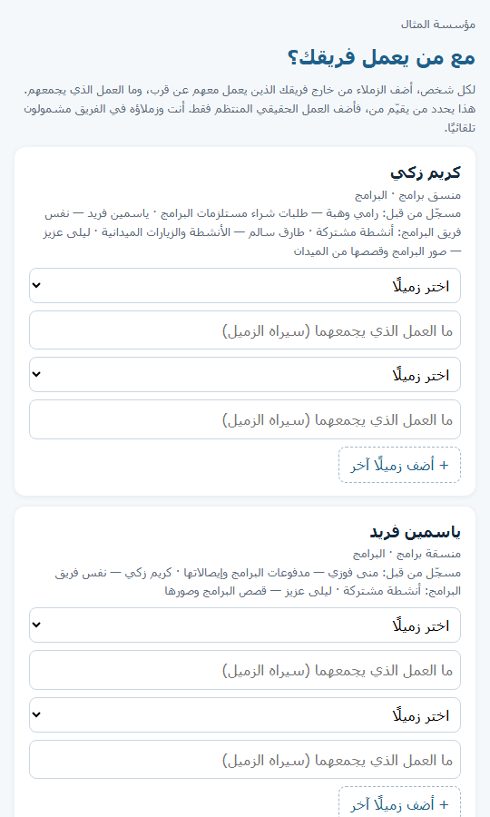

# دليل الإعداد

> النص العربي مسودة بمساعدة الذكاء الاصطناعي؛ نرحّب بملاحظاتكم لتحسينه.

للإعداد طريقتان، وتنتهيان إلى النتيجة نفسها: ملف Google Sheets في حساب مؤسستكم، مع صفحة تقييم شخصية لكل عضو في الفريق.

| | **أ. مع Claude Code** | **ب. يدويًا** |
|---|---|---|
| التكلفة | اشتراك مدفوع في Claude: خطة Pro بـ 20 دولارًا شهريًا، أو 17 دولارًا شهريًا عند الدفع السنوي ([الأسعار الحالية](https://claude.com/pricing)) | مجاني |
| ما تحتاجونه | تطبيق Claude لسطح المكتب وNode.js على حاسوبكم | متصفح ويب فقط |
| ما تفعلونه | تجيبون عن الأسئلة بكلمات بسيطة، وتضغطون بعض الأزرار في Google | تملؤون التبويبات بأنفسكم |
| الوقت لفريق من 20 شخصًا | نحو 1–2 ساعة أمام الحاسوب | نحو 2–3 ساعات أمام الحاسوب |
| قائمة فريقكم | تُكتب أو تُلصق في Claude، فتُرسل إلى Anthropic | تبقى في حساب Google الخاص بكم فقط |

**قبل أن تبدؤوا (في الطريقتين)**
- **Google Workspace.** تحتاج الصفحة الشخصية إلى أن تستخدم مؤسستكم Google Workspace: بريد عمل على نطاقكم الخاص تديره Google.
  - **كيف تتأكدون:** إذا كان بريد عملكم ينتهي باسم مؤسستكم (لا بـ @gmail.com) وتفتحونه على mail.google.com، فأنتم تملكونه.
    وإذا لم تكونوا متأكدين فاسألوا من أعدّ لكم البريد.
  - **إذا لم تكونوا تملكونه:** تحصل المؤسسات غير الربحية المسجّلة عليه مجانًا عبر
    [Google for Nonprofits](https://www.google.com/nonprofits/). قد تستغرق الموافقة من أيام إلى أسابيع، فابدؤوا مبكرًا.
  - يستطيع الموظفون الذين لا يملكون بريد عمل أن يشاركوا مع ذلك، على الورق.
- **مسؤول تقييم واحد.** قرّروا من يكون مسؤول التقييم: الشخص الوحيد الذي سيرى النتائج. استخدموا حساب عمله في كل ما يلي.
  وإذا كنتم تُعدّونه نيابةً عن المدير، فاتفقوا الآن على أيّكما يكون المسؤول؛ فتغييره لاحقًا صعب.
- **فريقكم.** جهّزوا قائمة الفريق: الاسم، وبريد العمل، والإدارة، والمسمى الوظيفي، والرئيس المباشر.
- **من يعمل مع من.** الجزء البطيء ليس الحاسوب، بل سؤال الرؤساء عمّن يعمل مع من عن قرب خارج فريقه. اسألوهم قبل البدء ببضعة أيام.

---

## أ. مع Claude Code
1. **ثبّتوا هذه البرامج** (مرة واحدة)، كلًّا بالخيارات الافتراضية:
   - [تطبيق Claude لسطح المكتب](https://claude.com/download)؛ وسجّلوا الدخول؛
   - [Node.js](https://nodejs.org): اضغطوا الزر المكتوب عليه **LTS**. يستخدمه Claude لفحص نسختكم وبنائها؛
   - على Windows فقط: [Git for Windows](https://git-scm.com/download/win)، ويحتاج إليه Claude ليعمل على حاسوبكم.
2. **نزّلوا هذا المشروع.** في صفحة المشروع على GitHub اضغطوا الزر الأخضر **Code** ثم **Download ZIP** (تنزيل ملف مضغوط). في مجلد
   التنزيلات اضغطوا على الملف بزر الفأرة الأيمن ثم **Extract All** (استخراج الكل)، وانقلوا المجلد إلى المستندات. كثيرًا ما يُنشئ
   Windows مجلدًا داخل مجلد بالاسم نفسه: اختاروا المجلد الذي يوجد فيه الملف `README.md` مباشرةً.
3. **ابدؤوا.** في تطبيق Claude افتحوا **Code**، واختاروا ذلك المجلد، واكتبوا **`/setup-360`** في مربع الرسالة، ثم اضغطوا Enter.
   يستأذنكم Claude قبل أن يشغّل كل خطوة على حاسوبكم. اقرؤوا سببه في سطر واحد، ثم اضغطوا **السماح** (`Allow`).
4. **أجيبوا عن أسئلة Claude**، سؤالًا سؤالًا:
   - اللغة؛
   - اسم المؤسسة؛
   - آخر موعد؛
   - قيمكم؛
   - فريقكم (الصقوه، أو أعطوه ملف جداول)؛
   - من يعمل مع من، ولماذا.

   يفحص Claude كل شيء ويعرض لكم من سيقيّم من.
5. **يضع Claude كل شيء في حساب Google الخاص بكم**، بإحدى طريقتين:
   - تلقائيًا: تفعّلون إعدادًا واحدًا وتسجّلون الدخول إلى Google في متصفحكم؛
   - أو بإعطائكم ملفًا واحدًا تلصقونه.
6. **يرشدكم Claude خلال نقرات Google التي لا يستطيع أحد غيركم إجراءها:** السماح للسكربت، ونشر الصفحة، وإرسال معاينة
   لأنفسكم.

**الخصوصية:** ما تكتبونه أو تلصقونه في Claude (الأسماء، وبريد العمل، ومن يرأس من) يُرسل إلى Anthropic حتى يستطيع Claude الرد
عليكم. لا يحتاج Claude إلى التقييمات ولا إلى التعليقات، فلا تلصقوها. تبقى الملفات المجهّزة في مجلد خاص اسمه `org` على
حاسوبكم وفي حساب Google الخاص بكم، ولا تُرفع أبدًا إلى GitHub. وإذا كان ذلك غير مقبول لدى مؤسستكم، فاستخدموا الطريقة ب.

---

## ب. يدويًا

### 1. أنشئوا الملف والصقوا الكود
1. افتحوا [sheets.new](https://sheets.new) وأنتم مسجّلو الدخول بحساب عمل مسؤول التقييم. سمّوا الملف، مثلًا `تقييم 360 لعام 2026`.
2. من قائمة الملف: **الإضافات** ثم **Apps Script**. وفي واجهة Google الإنجليزية: `Extensions → Apps Script`.
   تُفتح علامة تبويب جديدة فيها ملف اسمه `Code.gs`.
3. افتحوا [`dist/Code.gs`](../../dist/Code.gs) على GitHub واضغطوا زر `Copy raw file` (نسخ الملف الخام)، وهو المربعان الصغيران في
   أعلى الكود من جهة اليمين.
4. عودوا إلى علامة تبويب Apps Script واضغطوا داخل الكود. اضغطوا **Ctrl+A** ثم **Ctrl+V** (على جهاز Mac: **Cmd+A** ثم
   **Cmd+V**) لتستبدلوا كل ما فيه بما نسختموه.
5. اضغطوا **حفظ** (أيقونة القرص). ثم أغلقوا علامة تبويب Apps Script.
6. أعيدوا تحميل الملف. بعد ثوانٍ تظهر في الأعلى قائمة اسمها «360».

### 2. شغّلوا الإعداد
1. اختاروا «360» ← «ابدأ الإعداد». تطلب Google الإذن في المرة الأولى فقط:
   - اختاروا حسابكم؛
   - إذا ظهرت رسالة تفيد بأن Google لم تتحقق من هذا التطبيق، فاضغطوا **إعدادات متقدمة** ثم **الانتقال إلى المشروع**. وفي واجهة Google
     الإنجليزية: `Google hasn't verified this app`، ثم `Advanced`، ثم `Go to (your project) (unsafe)`؛
   - إذا ظهرت خانات للتعليم، فاختاروا **تحديد الكل** (`Select all`)؛ فالأداة تحتاج إليها كلها؛
   - اضغطوا **السماح** (`Allow`) أو **متابعة** (`Continue`).

   

   *الصورة رسم مبسّط لواجهة Google الإنجليزية؛ وتظهر الشاشة عندكم بلغة حساب Google الخاص بكم.*

   **لماذا هذا آمن:** السكربت موجود في ملفكم أنتم ويعمل في حسابكم أنتم. يطلب قراءة ملفاتكم ومستنداتكم وكتابتها (للتبويبات
   والتقارير)، وإرسال البريد باسمكم (للدعوات والتذكيرات)، وعرض صفحة لفريقكم. تكتب Google «غير آمن» (`unsafe`) لأي سكربت لم
   تراجعه بنفسها، ولا يُرسل شيء إلينا ولا إلى أي أحد. وإذا ظهرت رسالة بأن المسؤول حظره (`blocked`)، فراجعوا [حل المشكلات](troubleshooting.md).

   ثم اختاروا «360» ← «ابدأ الإعداد» مرة أخرى.
2. تُفتح اللوحة الجانبية. اختاروا اللغة، واملؤوا بيانات مؤسستكم وقيمكم، ثم اضغطوا «احفظ وأنشئ التبويبات». وإذا أردتم التجربة أولًا فعلّموا
   الخانة التي نصها: *املأ تبويب «الفريق» بفريق تجريبي وهمي لأجرّب أولًا*.

   
3. **أعيدوا تحميل الملف.** صارت القائمة تُسمّى «تقييم 360»، ويعرض تبويب «ابدأ هنا» كل خطوة.

   

### 3. املؤوا بيانات فريقكم
- **تبويب «الفريق»:** صف لكل شخص.
  - **«الرئيس المباشر (بريد أو اسم)»:** بريد رئيسه المباشر أو اسمه كما هو مكتوب تمامًا. اتركوه فارغًا لرأس المؤسسة فقط.
  - **«بريد العمل (فارغ = ورقي)»:** اتركوه فارغًا لمن لا يملك بريد عمل. سيُقيَّم إلكترونيًا ويقيّم الآخرين على الورق.
  - **«مشمول (نعم/لا)»:** اكتبوا «لا» لمن لا ينبغي أن يشارك في هذه الدورة.
- **تبويب «روابط العمل»:** من يعملون معًا عن قرب *خارج فريقهم*، مع السبب الذي سيراه المقيّم
  (مثل "طلبات شراء مستلزمات البرامج"). لا تحتاجون إلى كتابة الرؤساء وفرقهم: فهم يُضافون تلقائيًا.
- **تبويب «لا يقيّم أحدهما الآخر»** (اختياري): شخصان لا ينبغي أن يقيّم أحدهما الآخر أبدًا.
- **تبويب «روابط الإدارات»** (اختياري): أي الإدارات تقيّم أيّ إدارات. الإدارة التي ليس لها صف تقيّم كل الإدارات الأخرى.
- **تبويب «الأسئلة»:** الأسئلة التي سيجيب عنها الجميع. يمكنكم إعادة صياغتها الآن؛ راجعوا [التخصيص](customizing.md).

**اسألوا الرؤساء بدل ملاحقتهم (اختياري).** انشروا الصفحة الشخصية أولًا (الخطوة 5؛ ولا تُرسل شيئًا لأحد)، ثم «تقييم 360» ←
«اسأل الرؤساء: من يعمل مع من؟». تصل كل رئيس رسالة واحدة فيها رابط لصفحة قصيرة: لكل فرد في فريقه، يختار الزملاء من خارج الفريق
الذين يعمل معهم، ويكتب في أي عمل. تظهر إجاباتهم في تبويب «روابط العمل» مكتوبًا بجانبها «اقترحه» واسمه. اقرؤوها، ثم تابعوا.

### 4. افحصوا القوائم ثم ولّدوا قائمة من يقيّم من
1. «تقييم 360» ← «2) افحص الفريق والروابط». صحّحوا كل ما يذكره؛ فهو يشرح كل مشكلة بكلمات بسيطة.
2. «تقييم 360» ← «3) توليد قائمة من يقيّم من». اقرؤوا تبويب «من يقيّم من»: لكل صف سببه. ويمكنكم حذف صفوف أو إضافتها يدويًا.

### 5. انشروا الصفحة الشخصية
«الصفحة الشخصية» هي ما يفتحه موظفوكم ليملؤوا تقييمهم؛ وتسميها Google **تطبيق ويب** (`Web app`).
تفعلون هذا مرة واحدة، ويستغرق نحو 3 دقائق. «تقييم 360» ← «4) نشر الصفحة الشخصية» تفتح نافذة فيها هذه الخطوات، مرقّمة كما في الصورة:

*الصورة رسم مبسّط لواجهة Google الإنجليزية.*

1. من قائمة الملف: **الإضافات** ثم **Apps Script**. ثم في أعلى الصفحة: **نشر** ثم **نشر جديد**.
   وفي واجهة Google الإنجليزية: `Extensions → Apps Script`، ثم `Deploy → New deployment`.
2. اضغطوا الترس بجوار **اختيار النوع** ثم اختاروا **تطبيق ويب**. وفي واجهة Google الإنجليزية: `Select type`، ثم `Web app`.
3. اختاروا **التنفيذ باسم**: **أنا**، و**من يمكنه الوصول**: **أي شخص داخل مؤسستكم**. ثم اضغطوا **نشر**.
   وفي واجهة Google الإنجليزية: `Execute as: Me`، و`Who has access: Anyone within (your organisation)`، ثم `Deploy`.
4. قد تطلب Google الإذن مرة أخرى: اختاروا حسابكم ثم **السماح** (`Allow`).
5. انسخوا عنوان **تطبيق الويب** (ينتهي بـ `/exec`)، والصقوه في المربع الموجود في النافذة، ثم اضغطوا «احفظ العنوان».

أما الخطوة 6 في النافذة فهي لوقت لاحق، وفقط إذا تغيّر الكود: راجعوا [بعد تعديل الكود](admin-guide.md).

### 6. جرّبوا ثم أرسلوا معاينة
1. «تقييم 360» ← «جرّب: اختبار بأشخاص وهميين». تصفّحوا التبويبات ولوحة المؤسسة ومجلد التقارير.
   ثم اختاروا «جرّب: مسح الاختبار».
2. «تقييم 360» ← «5) أرسل لي معاينة». افتحوا الرسالة على هاتفكم، واضغطوا الزر، وأكملوا صفحتكم الشخصية من أولها إلى آخرها.

### 7. أخبروا الفريق، ثم ادعوهم
1. **أخبروهم أولًا**، في محادثة الفريق أو في اجتماع، قبلها بيوم أو يومين: ما التقييم، وأنه سري، وأن يفتحوا الدعوة بحساب بريد
   **العمل**. رسالة جاهزة: [الإعلان المقترح](ethics-and-privacy.md).
2. «تقييم 360» ← «6) إرسال الدعوات للفريق». تخبركم بعدد من سيُدعون وتطلب منكم التأكيد.
3. **كيف تعرفون أنها نجحت:** تظهر رسالة «تم إرسال {n} دعوة»، وتجدون الدعوات في مجلد **المرسل** (`Sent`) في Gmail، ويمتلئ تبويب
   «المتابعة» بعد «تحديث النتائج» كلما بدأ الناس.
4. وإذا كان أحد بلا بريد إلكتروني: «إنشاء نماذج ورقية لمن لا يملك بريدًا»، ثم اطبعوها. وعند عودتها يعرض «إدخال إجابات النماذج
   الورقية» رابطًا لكل شخص.

هذه أول صفحة يراها كل شخص:

التالي: [إدارة التقييم](admin-guide.md).

