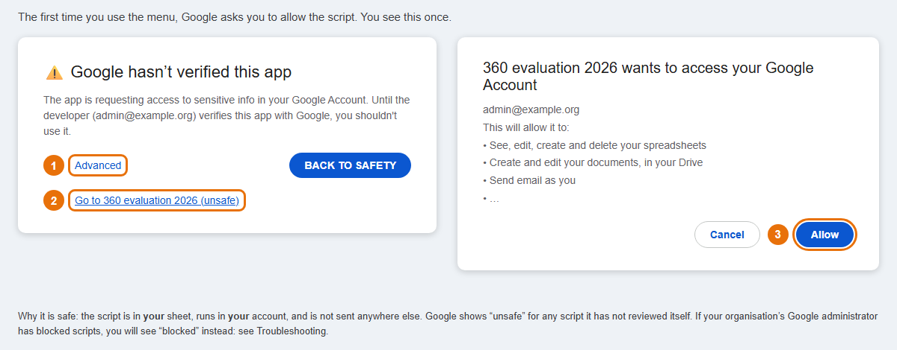
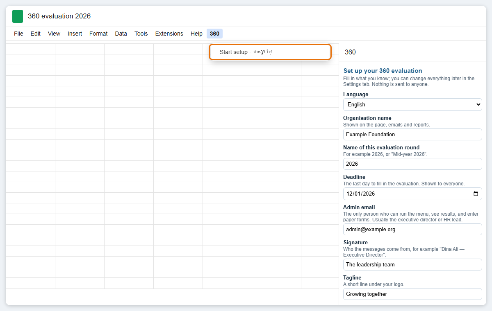
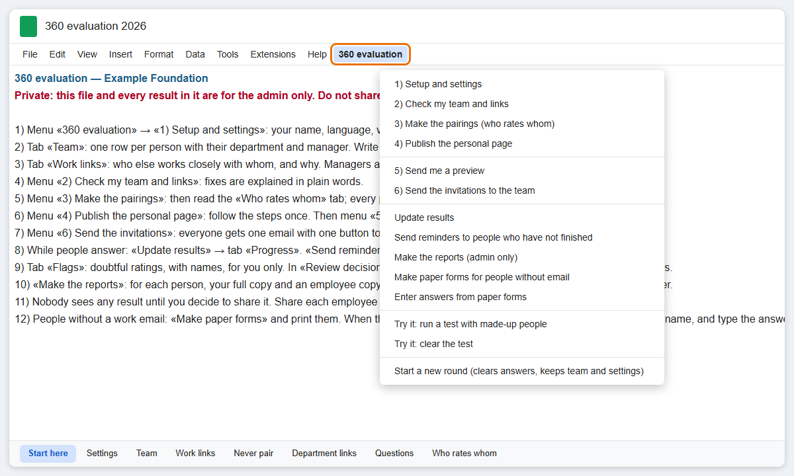
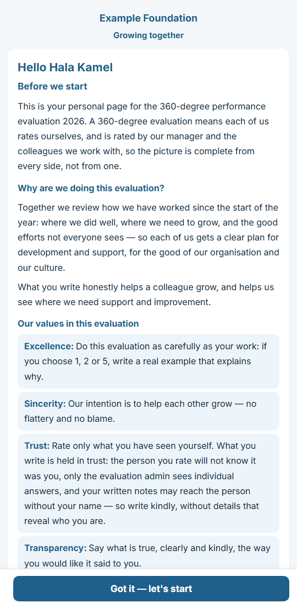
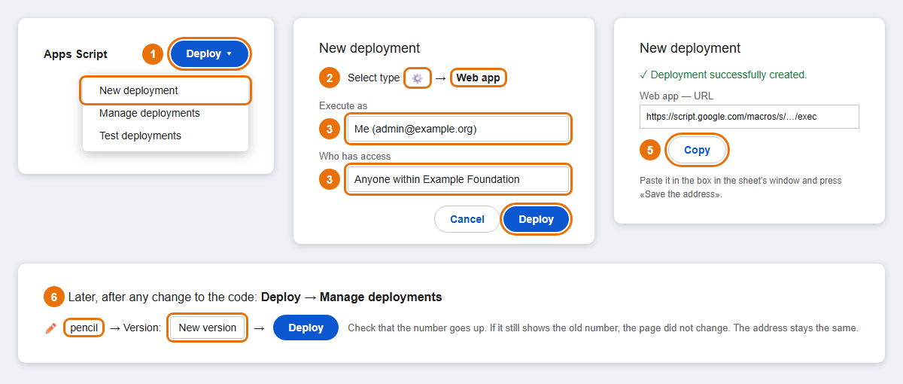
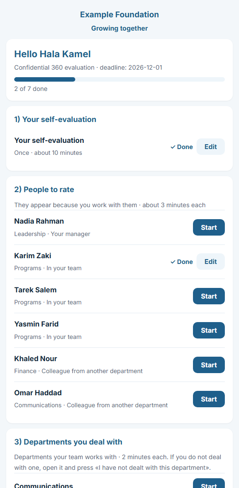

# Setup guide

Two ways to set up. Both end in the same place: a Google Sheet in your organisation's account, with a personal evaluation
page for every staff member.

| | **A. With Claude Code** | **B. By hand** |
|---|---|---|
| Cost | A paid Claude plan: Pro is US$20 a month, or $17 a month paid yearly ([current prices](https://claude.com/pricing)) | Free |
| You need | The Claude desktop app and Node.js on your computer | Only a web browser |
| You do | Answer questions in plain words; press a few buttons in Google | Fill in the tabs yourself |
| Time for a team of 20 | about 1–2 hours at the computer | about 2–3 hours at the computer |
| Your team list | Is typed or pasted into Claude, so it is sent to Anthropic | Stays in your Google account only |

**Before you start (both ways)**
- **Google Workspace.** The personal page needs your organisation to use Google Workspace: work emails on your own
  domain, managed by Google.
  - **How to check:** if your work email ends in your organisation's name (not @gmail.com) and you open it at
    mail.google.com, you have it. If you are not sure, ask whoever set up your email.
  - **If you don't have it:** registered nonprofits get it free through
    [Google for Nonprofits](https://www.google.com/nonprofits/). Approval can take days to weeks, so start early.
  - Staff without a work email can still take part, on paper.
- **One admin.** Decide who the admin is: the only person who will see results. Use that person's work account for
  everything below.
- **Your team.** Have your team list ready: name, work email, department, job title, and direct manager.
- **Who works with whom.** The slow part is not the computer: it is asking managers who works closely with whom
  outside their own team. Ask them a few days before you start.

---

## A. With Claude Code
1. **Install two programs** (once):
   - the [Claude desktop app](https://claude.com/download); sign in;
   - [Node.js](https://nodejs.org): press the button marked "LTS" and install it with the default choices. Claude uses it to check and build your copy.
2. **Download this project.** On the project's GitHub page press the green **Code** button → **Download ZIP**. In your
   Downloads folder right-click the file → **Extract All**, and move the folder to Documents.
3. **Start.** In the Claude app open **Code**, choose that folder, type **`/setup-360`** in the message box and press Enter.
   - Claude asks before it runs each step on your computer. Read its one-line reason and press **Allow**.
   - On Windows, if Claude says it needs Git, install [Git for Windows](https://git-scm.com/download/win) with the
     default choices and start again.
4. **Answer Claude's questions**, one at a time:
   - language;
   - organisation name;
   - deadline;
   - your values;
   - your team (paste it, or give a spreadsheet);
   - who works with whom, and why.

   It checks everything and shows you who will rate whom.
5. **Claude puts it in your Google account**, in one of two ways:
   - automatically: you switch on one setting and sign in with Google in your browser;
   - or by giving you one file to paste.
6. **Claude walks you through the Google clicks only you can do:** allowing the script, publishing the page, and
   sending yourself a preview.

**Privacy:** what you type or paste into Claude (names, work emails, who manages whom) is sent to Anthropic so Claude can
answer you. Claude never needs ratings or comments, so do not paste them. The prepared files stay in a private `org`
folder on your computer and in your own Google account, never on GitHub. If that is not acceptable for your
organisation, use route B.

---

## B. By hand

### 1. Make the sheet and paste the code
1. Go to [sheets.new](https://sheets.new), signed in with the admin's work account. Name the sheet, for example "360 evaluation 2026".
2. In the sheet's menu: **Extensions → Apps Script.** A new tab opens with a file called `Code.gs`.
3. Open [`dist/Code.gs`](../../dist/Code.gs) on GitHub and press the **Copy raw file** button: the two small squares
   at the top right of the code.
4. Go back to the Apps Script tab and click inside the code. Press **Ctrl+A** then **Ctrl+V** (on a Mac: **Cmd+A**,
   **Cmd+V**) to replace everything with what you copied.
5. Press **Save** (the disk icon). Close the Apps Script tab.
6. Reload the sheet. After a few seconds a menu called **360** appears at the top.

### 2. Run the setup
1. Choose **360 → Start setup · ابدأ الإعداد**. Google asks for permission the first time, once:
   - choose your account;
   - if it says "Google hasn't verified this app", press **Advanced**, then **Go to (your project) (unsafe)**;
   - press **Allow**.

   

   **Why this is safe:** the script lives in *your* sheet and runs in *your* account. It asks to read and write your
   sheets and documents (for the tabs and reports), send email as you (the invitations and reminders), and show a
   page to your team. Google says "unsafe" for any script it has not reviewed itself; nothing is sent to us or anyone
   else. If you see "blocked by your administrator" instead, see [Troubleshooting](troubleshooting.md).

   Then choose **360 → Start setup** again.
2. The side panel opens. Choose the language, fill in your organisation's details and your values, and press **Save
   and build my tabs**. To try it first, tick "Fill the Team tab with a made-up example team, so I can try it first".

   
3. **Reload the sheet.** The menu is now called **360 evaluation**, and a **Start here** tab lists every step.

   

When you invite the team, this is the first page each person sees:

### 3. Fill in your team
- **Team tab:** one row per person.
  - **Manager:** their direct manager's email or their exact name. Leave it empty only for the head of the organisation.
  - **Work email:** leave it empty for someone without one. They will be rated online and rate others on paper.
  - **Included:** write "no" for anyone who should not take part this round.
- **Work links tab:** people who work closely together *outside their own team*, with the reason the rater will see
  (for example "Purchase requests for program supplies"). You do not need to list managers and their teams: they are
  added automatically.
- **Never pair tab** (optional): two people who should never rate each other.
- **Department links tab** (optional): which departments rate which. A department with no row rates all the others.
- **Questions tab:** the questions everyone will answer. You may reword them now; see [Customising](customizing.md).

### 4. Check and make the pairings
1. **360 evaluation → 2) Check my team and links.** Fix anything it lists; it explains each problem in plain words.
2. **360 evaluation → 3) Make the pairings (who rates whom).** Read the **Who rates whom** tab: every row has its
   reason. You can delete or add rows by hand.

### 5. Publish the personal page
The "personal page" is what your staff open to fill in their evaluation; Google calls it a **web app**.
You do this once; it takes about 3 minutes. **360 evaluation → 4) Publish the personal page** opens a window with
these six steps, numbered like the picture:

1. In the sheet's menu: **Extensions → Apps Script**. Then, at the top right, **Deploy → New deployment**.
2. Click the gear next to "Select type" → **Web app**.
3. **Execute as: Me.** **Who has access: Anyone within (your organisation).** Then **Deploy**.
4. Google may ask for permission again: choose your account → **Allow**.
5. Copy the **Web app** address (it ends in `/exec`), paste it in the box in the window, and press **Save the address**.
6. Later, after any change to the code: **Deploy → Manage deployments** → pencil → Version: **New version** → **Deploy**.
   Check that it shows a new version number; the address stays the same.

### 6. Try it, then preview
1. **360 evaluation → Try it: run a test with made-up people.** Look at the tabs, the dashboard and the reports folder.
   Then **Try it: clear the test**.
2. **360 evaluation → 5) Send me a preview.** Open the email on your phone, press the button, and walk through your own page.

### 7. Invite the team
**360 evaluation → 6) Send the invitations to the team.** It tells you how many people will be invited and asks you to confirm.
If anyone has no email: **Make paper forms for people without email**, and print them. When they come back,
**Enter answers from paper forms** shows one link per person.

Next: [Running the evaluation](admin-guide.md).
